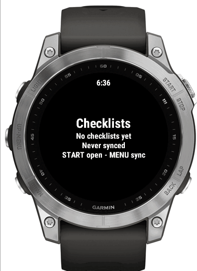
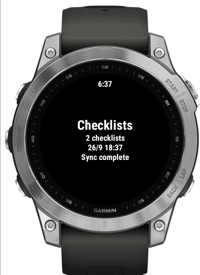
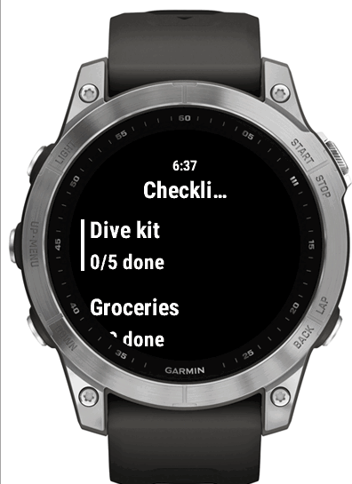
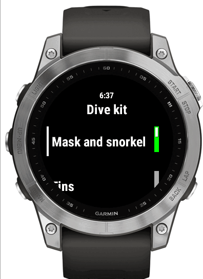

# Getting started

Four steps. About fifteen minutes.

## 1. Run the bridge

```bash
cp .env.example .env
vim .env               # admin password + your HTTPS URL
docker compose up -d
```

> **The bridge must sit behind an HTTPS reverse proxy.** The watch refuses plain
> HTTP — `makeWebRequest` fails with `SECURE_CONNECTION_REQUIRED` before the
> request is even sent, and an untrusted certificate shows up as a bare `404`.
> See [Running the bridge](bridge.md).

## 2. Add checklists

Open the bridge URL in a browser and sign in. Tap a provider tile:

- **Vikunja** — URL and API token, **Save and test**, tick the projects you
  want, **Import selected**. See [Vikunja](vikunja.md).
- **Trilium Notes** — URL and ETAPI token; notes tagged `#checklist` are
  offered, and lines starting `[]` become items. See [Trilium](trilium.md).
- **On this bridge** — no account anywhere: add a checklist and type its items,
  one per line.

The *On the watch after the next sync* card shows exactly what the watch will get.

## 3. Install the app

```bash
export CIQ_KEY=/path/to/developer_key.der
just watch-build                        # or CIQ_DEVICE=descentg2
```

Copy `build/checklists-fenix7.prg` to the watch — see
[Installing on a watch](install-on-watch.md).

## 4. Pair it

Copy the **bridge URL** and **device token** from the bridge's web page (there
are copy buttons) into Garmin Connect → your watch → Connect IQ Apps →
Checklists → Settings.

Nothing is typed on the watch itself.

## First sync

Open Checklists and press **MENU** (long UP), or **START** while it says
*No checklists yet*.

|  |  |
| --- | --- |
| Before pairing | After the first sync |

## Daily use

|  |  |  |
| --- | --- | --- |
| How many checklists, when they arrived | **START** opens the list | **START** ticks an item |

- Ticks save immediately and survive closing the app.
- **Sync now** re-fetches the templates and clears every tick.
- Nothing you do on the watch changes anything upstream.
