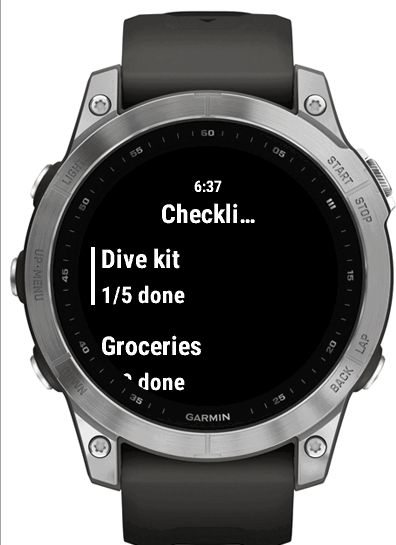
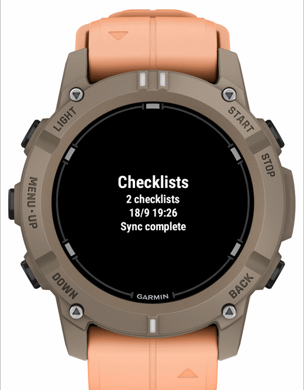
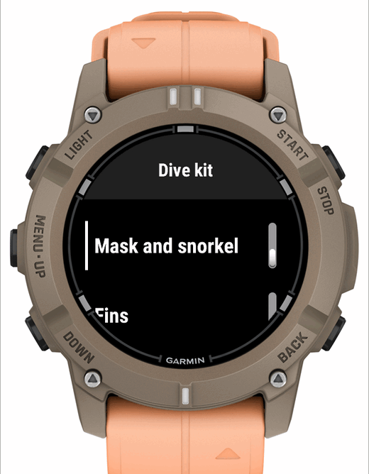

# The watch app

## Using it

|  |  |  |
| --- | --- | --- |
| Home | Checklist index | One checklist |

| Screen | Keys |
| --- | --- |
| Home | **START** opens the checklists · **MENU** (long UP) syncs |
| Index | **START** opens one · last entries are **Sync now** and **Settings** |
| Checklist | **START** ticks · **BACK** returns |

A sync replaces every checklist and clears every tick. That is how you reset a
template for its next use.

## Settings

Entered on your phone in Garmin Connect:

| Setting | Example |
| --- | --- |
| Bridge URL | `https://checklists.example.com` |
| Device token | `K7QF-2M9X-PLDR` |

The URL and token have copy buttons on the bridge's web page. A trailing slash
is fine.

Everything else -- the clock and auto-sync -- is a toggle in the watch's own
**Settings**, below.

## Auto-sync

With **Sync hourly** on, the watch runs the ordinary sync once an hour in the
background, without the app being open. It makes the same read-only requests
as **MENU**, and nothing is ever sent back to the bridge.

```{warning}
An auto-sync is a sync: it replaces every checklist and **clears every tick**.
A list you left half ticked will be reset the next time the app starts after an
auto-sync. That is why it is off by default.
```

- The background run only fetches. It parks the result, and the app applies
  it when it next starts, or when you are back on the home screen if the app
  is already open. The home screen then says *Auto-synced*, and the time shown
  is when the lists were fetched.
- A failed run is silent: no phone in range, Garmin Connect not running, a
  rejected token. There is no retry before the next hour. If the time on the
  home screen stops moving, run a manual sync to see why.
- It gives up on more than 15 checklists, because a background run is killed
  after 30 seconds. A manual sync still handles up to 40.
- Toggling it in the watch's own Settings, below, takes effect at once: it can
  only be changed while the app is running, which is exactly when it is able
  to add or remove the background registration.

### On the watch

**Settings**, the last entry in the checklist index, holds the preferences
that belong to the watch itself, not the bridge:

| Setting | Default | Effect |
| --- | --- | --- |
| Show clock | On | The time at the top of the home screen and of each menu, in the watch's 12h/24h format |
| Sync hourly (clears ticks) | Off | See [Auto-sync](#auto-sync), above |

Both are kept in the app's storage on the watch, are never sent to the bridge,
and a sync leaves them alone. Inside the menus the time shares the title area
with the menu's name, because `Menu2` draws its rows in firmware and offers no
way to paint over them; where the firmware scrolls the title away, the time
goes with it.

## Supported devices

`fenix7 fenix7s fenix7x fenix7pro fenix7spro fenix7xpro descentg2`

Add another with one `<iq:product id="…"/>` line in `watch/manifest.xml`. Ids
are the directory names under `$CIQ_SDK/bin/devices`. `minApiLevel` is 3.1.0,
the floor for `Menu2` / `ToggleMenuItem`.

The home screen sizes itself from the device's font metrics and stays in the
middle of the display, so it needs no per-device layouts:

|  |  |
| --- | --- |
| The same build on a Descent G2 | |

## Building

Needs the [Connect IQ SDK](https://developer.garmin.com/connect-iq/sdk/) and a
developer key:

```bash
openssl genrsa -out developer_key.pem 4096
openssl pkcs8 -topk8 -inform PEM -outform DER \
    -in developer_key.pem -out developer_key.der -nocrypt
```

```bash
export CIQ_KEY=/path/to/developer_key.der
just watch-build                        # fenix7
CIQ_DEVICE=descentg2 just watch-build
just watch-sim                          # build + run in the simulator
just watch-package                      # .iq bundle
```

Builds run at type-check level 3, the strictest. It is the only automated check
Monkey C gets, so keep it clean.

### Two rules the compiler enforces

- **`private` is not a module-level modifier.** It works in a `class`; a
  `module` member can only be `public`. There is no module-private.
- **A dictionary literal loses its keyed type when returned from a function.**
  `makeWebRequest` takes a keyed options dictionary, so the literal must be
  written at the call site.

Also stricter than it looks: `String.substring` returns `String?`,
`Gregorian.Info.day` is `Number or String`, and `Storage.setValue` takes
`Application.Storage.ValueType`.

### The simulator

It needs three things from the SDK Manager, not two:

```text
~/.Garmin/ConnectIQ/Sdks/      the SDK
~/.Garmin/ConnectIQ/Devices/   one directory per device
~/.Garmin/ConnectIQ/Fonts/     the .cft files the devices reference
```

Without `Fonts/`, the app launches and then dies on its first `drawText` with
*Invalid Font Specified*.

On Linux it also wants `libwebkit2gtk-4.0` and `libsoup2.4`, which Ubuntu 24.04
no longer ships; the 22.04 builds work on `LD_LIBRARY_PATH`. It runs fine
headless under `Xvfb`.

## Source map

| File | Responsibility |
| --- | --- |
| `ChecklistsApp.mc` | Entry point |
| `AppConfig.mc` | Reads the Garmin Connect settings |
| `Store.mc` | Persistent checklists, tick state, the clock preference and a parked background fetch |
| `SyncTask.mc` | Index request, then one request per checklist; shared by both syncs |
| `AutoSync.mc` | The hourly background sync: scheduling and the service delegate |
| `MainView.mc` / `MainDelegate.mc` | Home screen and input |
| `IndexMenu.mc` | The list of checklists |
| `ItemsMenu.mc` | One checklist as toggles |
| `SettingsMenu.mc` | The watch's own settings (the clock toggle) |
| `Clock.mc` | The time readout, its Menu2 title drawable and the minute timer |

Menus rebuild from storage when opened, so nothing shows stale data.

## Troubleshooting

| On screen | Meaning |
| --- | --- |
| `Set URL + token` | A setting is empty — or a stale `.SET` is overriding a baked-in build |
| `Phone not connected` | No Bluetooth link, or Garmin Connect is not running |
| `Token rejected` | The token was rotated on the bridge |
| `Sync failed (-1001)` | The bridge is on plain HTTP; it must be HTTPS |
| `Sync failed (404)` | Wrong URL, or an untrusted TLS certificate |
| `No checklists yet` | Nothing selected on the bridge, or not synced yet |
